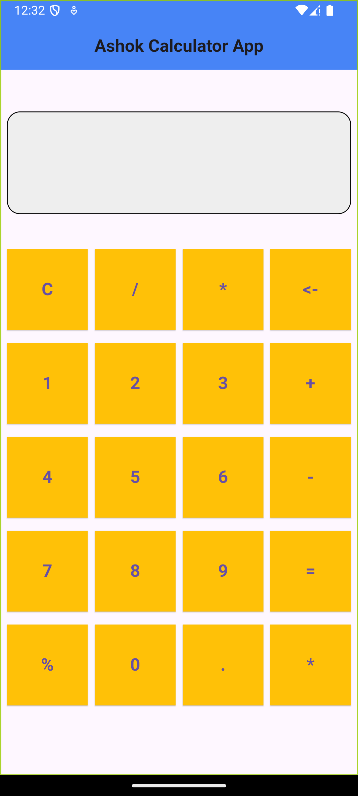
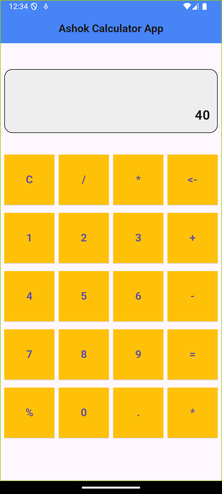
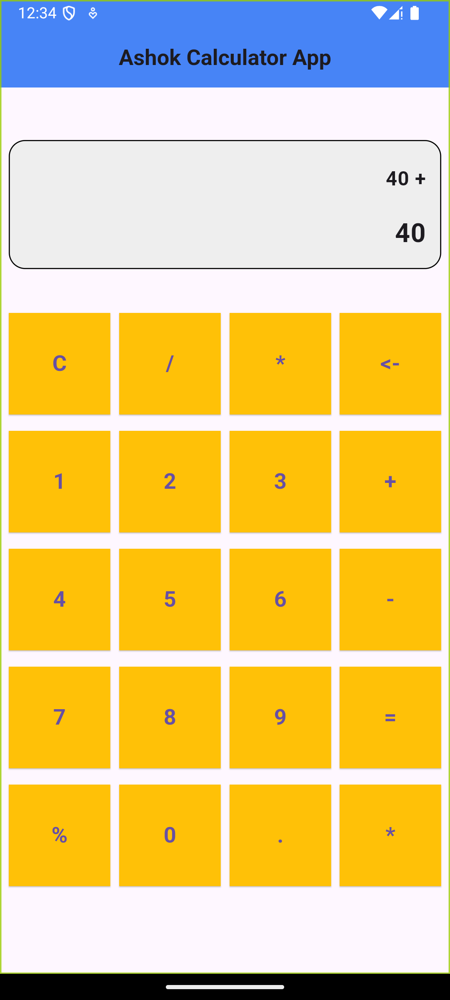
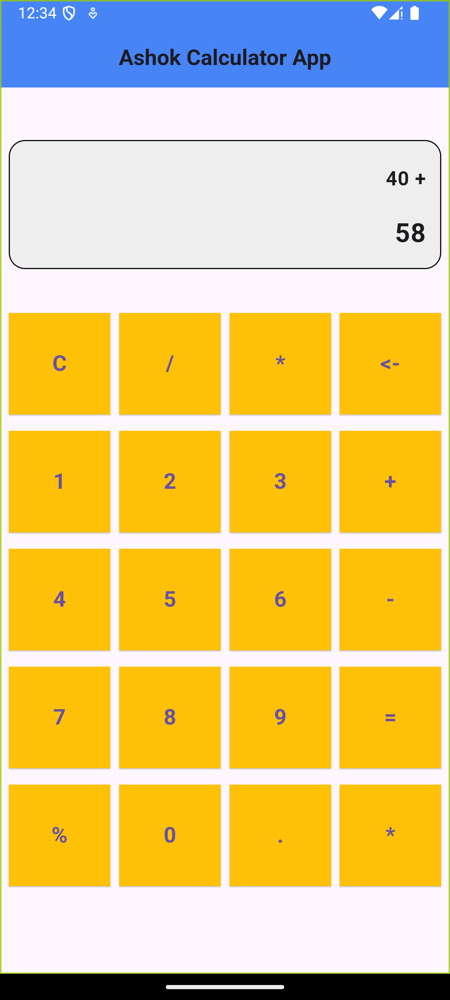
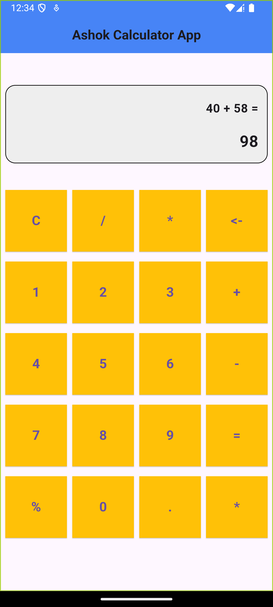
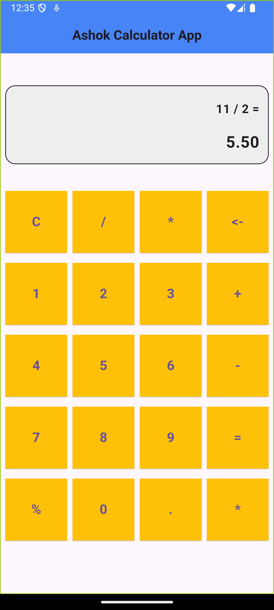

# Calculator

## Calculator View
This is the main view of the calculator.

## First Number Input
The first number is displayed in the text field, which is disabled. You must use the buttons to input the numbers.

## Operator Selection
Once an operator is clicked, the first number is shown in the history. The first number remains in the text field unless the second number is entered.

## Entering the Second Number
After entering the second number, the text field displays the second number while the first number is saved for the calculation.

## Calculation Result
The result is shown below the history. If the result is a decimal number with a value equal to an integer (like 6.0), it will be displayed as an integer (6).

## Example of Decimal Calculation
Here is an example of a decimal calculation.

